<!-- Please do not change this html logo with link -->

# DC Power Measurement using PIC16F15244 Microcontroller

DC power supply is widely used in numerous applications that are operating with lower supply voltage. A few of these applications require monitoring the power consumed by the load connected to its electronic circuitry. The Analog-to-Digital Convertor (ADC) of a microcontroller is useful to measure voltage and current consumed by the load. Thereby it is possible to compute the total power consumed by the load.

The PIC16F15244 family microcontrollers offers 10-bit ADC and Enhanced Universal Synchronous Asynchronous Receiver Transmitter (EUSART) which are the common peripherals used in various embedded applications. The ADC peripheral is used for converting analog signal in to digital, and EUSART peripheral is used for communication with the external integrated circuits. Additionally, the EUSART interface can communicate with terminal application on a personal computer.

This code example highlights the DC power measurement technique using the PIC16F15244 microcontroller. It demonstrates how to use ADC to measure DC voltage, current and power consumed by the connected load in an electronic circuitry, and then transmit the measured data to terminal window of data visualizer tool through EDBG module (UART-USB bridge).

## Related Documentation

- [PIC16F15244 Product Family Page](https://www.microchip.com/en-us/products/microcontrollers-and-microprocessors/8-bit-mcus/pic-mcus/pic16f15244)
- [PIC16F15244 Family Code Examples on GitHub](https://github.com/microchip-pic-avr-examples?q=pic16f15244&type=&language=&sort=)
- [PIC16F15244 Product Family Overview Video](https://www.youtube.com/watch?v=nHLv3Th-o-s)
- [PIC16F15244 Microcontroller Product Page](https://www.microchip.com/wwwproducts/en/PIC16F15244)

## Demo Description 

In this code example, current and voltage measuring circuitry is built on a proto click to keep the measuring voltages within a voltage range accepted by the ADC peripheral.

The voltage measuring circuitry is a simple voltage divider circuit, made using resistor network, capable of measuring DC voltages in the range of 0 to 25V. The voltage divider circuit scale-down the measuring voltage and then fed it as input to the ADC.

The current measurement circuit is a current mirror circuit, which generates voltage signal in proportion to the current flowing through the connected load. The designed current mirror circuit is capable of measuring load current in the range of 0 to 5A. The generated voltage signal is fed as input to the ADC.

Using ADC peripheral, the PIC16F15244 microcontroller sense the input voltages, process the acquired data, and then compute the voltage and current consumed by the load. From the computed load current and voltage values, the total power consumed by the load will also be computed.

  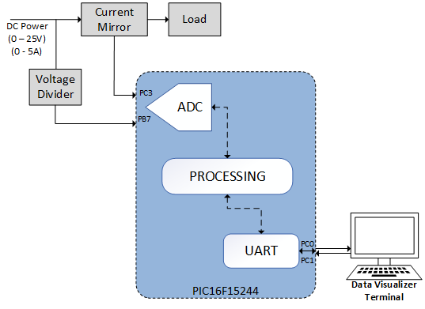
   Figure 1 : System Overview Block Diagram 

### Voltage measurement circuit

  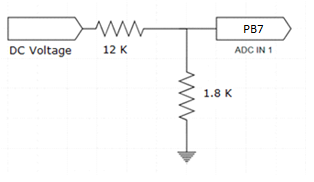
   Figure 2 : Voltage Divider Circuit 

### Current measurement circuit

  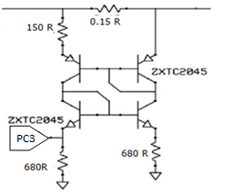
   Figure 3 : Current Measurement Circuit 

## Software Used

- MPLAB® X IDE [6.0.0 or newer](http://www.microchip.com/mplab/mplab-x-ide)
- MPLAB® XC8 compiler [2.36.0 or newer](http://www.microchip.com/mplab/compilers) 
- Microchip PIC16F1xxxx Series Device Support [1.9.163 or newer pack](https://packs.download.microchip.com/)
- MPLAB® Code Configurator (MCC) [5.1.1 or newer](https://www.microchip.com/mplab/mplab-code-configurator)
- ADC MCC Melody driver 3.0.6
- TMR0 MCC Melody driver 4.0.8
- UART MCC Melody driver 1.6.0
- GPIO/Pins drivers MCC Melody driver 3.2.2

**Note: For running this demo, the installed tool version should be same or later. This example is not tested with the previous versions.**
 
## Hardware Used

- [PIC16F15244 Curiosity Nano Board](https://www.microchip.com/en-us/development-tool/EV09Z19A)
- [Curiosity Nano Base for Click Boards](https://www.microchip.com/en-us/development-tool/AC164162)
- [PROTO click](https://www.mikroe.com/proto-click)

## Hardware Setup

The PIC16F15244 Curiosity Nano evaluation kit along with the proto click is used and it is mounted on a Curiosity Nano base for Click boards for DC power measurement.  The following figure shows hardware setup of the application. Refer hardware connection details table for more information.

  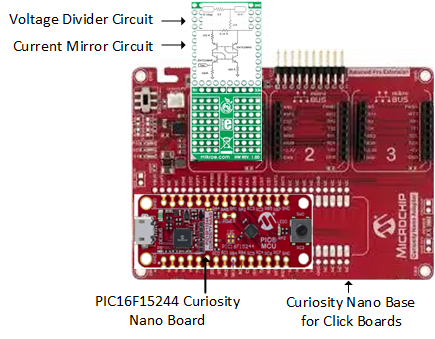
   Figure 4 : DC Power Measurement Hardware Setup 

### Hardware Connection Details

|Sl No. | Microcontroller pin | Pin Configuration | Signal name |I/O Pin Direction |
|:---------:|:----------:|:-----------:|:---------:|:------------:|	
| 1     | RB7	| ADC Channel	        | ANB7	| IN  |	
| 2     | RC3	| ADC Channel	        | ANC3	| IN  |
| 3     | RC1	| EUSART Rx Pin	        | RX	| IN  |
| 4     | RC0	| EUSART Tx	Pin         | TX	| OUT  |
		
## Steps to open Terminal window in Data Visualizer

Use the terminal window of data visualizer tool to display the measured power data. Follow the below steps to open terminal window.

1. Click on the data visualizer icon on MPLAB X IDE or open the standalone data visualizer.

  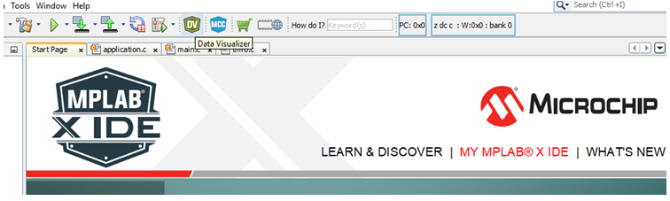
   Figure 5 : Data Visualizer icon on MPLAB IDE 

  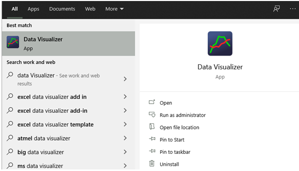
   Figure 6 : Standalone Data Visualizer icon 

2. In the data visualizer window, click on Configuration tab.

  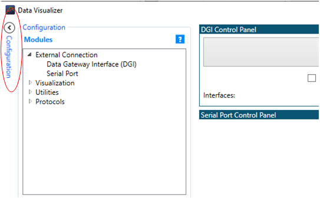
   Figure 7 : Data Visualizer Configuration Window 

3. In the Modules section, expand External connection option and then double click on Serial port.

  
   Figure 8 : Data Visualizer Modules Window 

4.	From Serial Port Control Panel, select the Curiosity Virtual Com Port which is connected to the host device.

  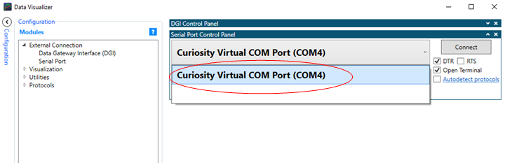
   Figure 9 : Data Visualizer Serial Control Panel 

5.	Check the “Open Terminal” option.

  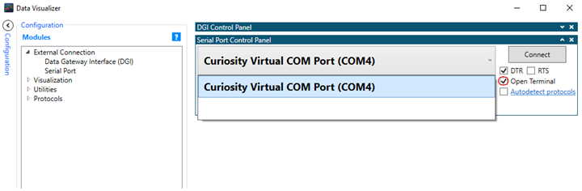
   Figure 10 : Data Visualizer Serial Port Open Terminal 

6. Make sure terminal baudrate is set to 9600.

  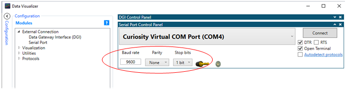
   Figure 11 : Data Visualizer Serial Port Configuration 

7. Click on Connect button and then terminal window is opened. 

  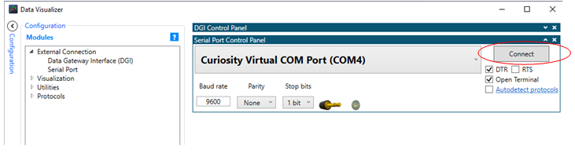
   Figure 12 : Data Visualizer Serial Port Connect 

## Demo Operation 

1. Setup the hardware as shown in hardware setup section.
2. After the curiosity nano board is powered up, load the application firmware to PIC16F15244 microcontroller.
3. Set the desired input voltage and current from the DC source/Load and check the data displayed on terminal window.
4. Vary the DC voltage and current from the DC source/Load and check the data displayed on terminal window.    

